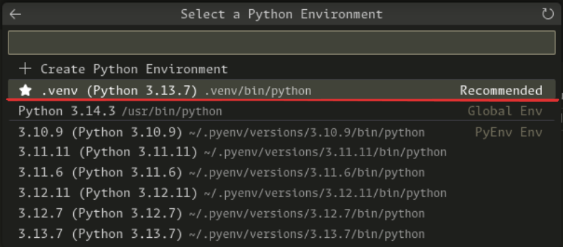

# DMT Assignment 1 (Group 9)

## Setup
This codebase uses the following tools:
- [Poetry](https://python-poetry.org/): for python project and dependency management
- [Pyenv](https://github.com/pyenv/pyenv): for python version management

Please follow the links to set the tools locally.
After you're done you can continue with the repo setup:
```bash
pyenv install                   # intsalls the python version needed for the codebase
poetry intall                   # installs the needed python dependencies
poetry run pre-commit install   # installs the pre-commit hooks
```

Whenever you wish to execute a python script from the terminal, you can do it by running it through poetry:
```bash
poetry run python some_file.py
```

If you're working in jupyter notebooks from VSCode, you can use the project's virtual environment's pyhon interpreter (with all the dependencies installed) by:
1. Creating a `.ipynb` file
2. Clicking "select kernel" in the top right
3. Clicking "python environments" and  selecting the local `.venv` one



> [!NOTE]
> You may need to install the `Jupyter` [extention](https://marketplace.visualstudio.com/items?itemName=ms-toolsai.jupyter) in the VS Code
